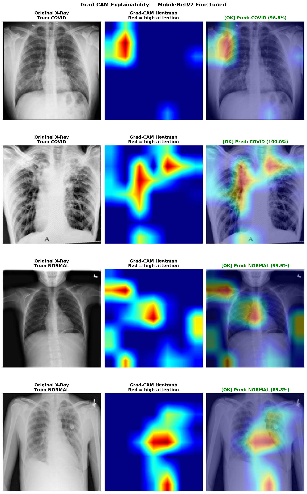
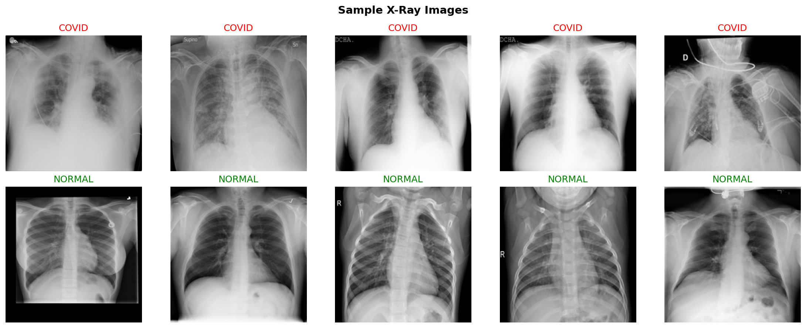
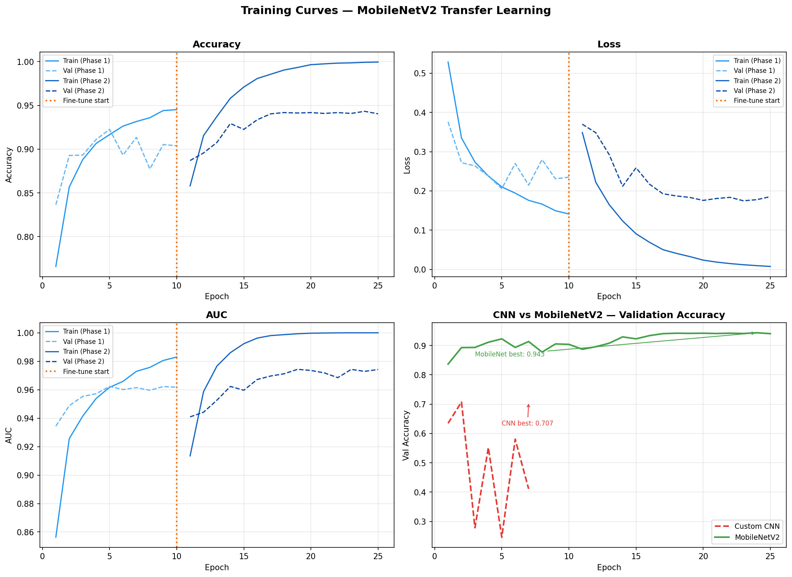

# 🫁 AI-Powered COVID-19 Pulmonary Diagnostic Assistant

> Deep Learning-based chest X-ray classification system for COVID-19 detection 
> with Grad-CAM explainability — built with TensorFlow and deployed via Streamlit.

[](https://deep-learning-project-on-lungs-aytadicnpfy6fdrnjinwxu.streamlit.app/)


---

## Live Demo
**[Launch the App](https://deep-learning-project-on-lungs-aytadicnpfy6fdrnjinwxu.streamlit.app/)**

Upload any chest X-ray and get an instant prediction with a Grad-CAM 
explainability heatmap showing which lung regions influenced the decision.

---

## Project Overview

Early and accurate detection of COVID-19 from chest X-rays can significantly 
assist clinical triage and reduce diagnostic delays. This project builds and 
compares two deep learning approaches:

- A **Custom CNN** trained from scratch as a strong baseline
- A **Fine-tuned MobileNetV2** using two-phase transfer learning as the 
  production-grade model

The final model achieves **95.05% accuracy** and **0.9808 AUC-ROC** on a 
held-out test set of 2,062 images — with a **Recall of 97.82%**, meaning it 
correctly identifies 97.82% of all real COVID-19 cases.

---

## App Screenshots

| COVID-19 Detection | Normal Detection |
|---|---|
|  |  |

---

## Model Performance

| Metric | Custom CNN | MobileNetV2 (Fine-tuned) |
|---|---|---|
| Accuracy | 71.48% | **95.05%** |
| F1 Score | 0.7835 | **0.9667** |
| Precision | 0.8859 | **0.9555** |
| Recall | 0.7023 | **0.9782** |
| AUC-ROC | 0.7735 | **0.9808** |

> MobileNetV2 outperforms the custom CNN by **+23.57%** in accuracy and 
> **+27.59%** in Recall — the most critical metric for medical screening.

---

## Project Structure 
```text
DEEP-LEARNING-PROJECT-ON-LUNGS/
│
├── data/
│   └── lung_dataset/
│       ├── covid/               # COVID-19 positive X-rays
│       └── normal/              # Normal X-rays
│
├── notebooks/
│   └── deep_learning_lung_project.ipynb   # Full training pipeline
│
├── models/
│   ├── best_cnn.keras
│   ├── best_mobilenet_phase1.keras
│   ├── best_mobilenet_phase2.keras
│   ├── final_cnn_model.keras
│   └── final_mobilenet_model.keras
│
├── outputs/
│   ├── class_distribution.png
│   ├── sample_images.png
│   ├── training_curves.png
│   ├── custom_cnn_evaluation.png
│   ├── mobilenetv2_fine-tuned_evaluation.png
│   ├── gradcam_mobilenetv2_fine-tuned.png
│   └── model_comparison.csv
│
├── src/
│   └── app.py                   # Streamlit web application
│
├── requirements.txt
├── requirements-complete.txt
└── README.md
```

---

## Model Architecture

### Custom CNN (Baseline)
- 4 convolutional blocks with BatchNormalization and Dropout
- `he_normal` weight initialization for stable ReLU training
- GlobalAveragePooling → Dense(256) → Sigmoid output
- ~457K trainable parameters

### MobileNetV2 (Production Model)
- Pretrained on ImageNet (2.26M frozen parameters)
- **Phase 1:** Train classification head only — 328K trainable params
- **Phase 2:** Unfreeze last 30 layers (BatchNorm kept frozen) — fine-tune 
  with `lr=1e-5` and gradient clipping
- `preprocess_input` baked inside model graph for deployment safety

---

## Technical Highlights

- **Two-phase fine-tuning** — head training followed by selective layer 
  unfreezing with 10x lower learning rate
- **BatchNorm freezing** — preserves ImageNet statistics during fine-tuning, 
  prevents instability
- **Grad-CAM explainability** — visualizes spatial attention on lung regions 
  to support clinical interpretability
- **Data augmentation** — RandomFlip, RandomRotation, RandomZoom, 
  RandomContrast applied only during training
- **70/15/15 split** — strict train/val/test separation with no data leakage
- **Medical metrics** — F1, Recall, Precision and AUC-ROC reported alongside 
  accuracy for clinically meaningful evaluation

---

## Training Curves



The orange dotted line marks the transition from Phase 1 (head only) to 
Phase 2 (fine-tuning). Val accuracy climbs steadily with no instability — 
in contrast to the custom CNN which oscillated wildly.

---

## Grad-CAM Explainability


Grad-CAM heatmaps confirm the model focuses on clinically relevant lung 
regions — bilateral infiltrates and ground-glass opacities characteristic 
of COVID-19 — rather than background artefacts.

---


### Dataset
"COVID-19 Radiography Database"
Tawsifur Rahman, Amith Khandakar, et al.
Available on Kaggle

- 13,808 total images
- 3,616 COVID-19 positive
- 10,192 Normal
- Image format: PNG, 299×299px

## Tech Stack

| Tool | Purpose |
|------|---------|
| TensorFlow 2.15 | Model training and inference |
| Keras | High-level neural network API |
| MobileNetV2 | Pretrained base model (ImageNet) |
| OpenCV | Image processing and Grad-CAM overlay |
| Scikit-learn | Evaluation metrics |
| Streamlit | Web application deployment |
| Matplotlib / Seaborn | Visualizations |
| Pandas / NumPy | Data manipulation |

### Notebook Pipeline
- The training notebook covers the full ML pipeline:
1. Exploratory Data Analysis — class distribution, sample images
2. Data loading with 70/15/15 train/val/test split
3. Preprocessing — normalization, augmentation pipeline
4. Custom CNN baseline — architecture, training, evaluation
5. MobileNetV2 Phase 1 — frozen base, head training
6. MobileNetV2 Phase 2 — selective fine-tuning
7. Training curves — accuracy, loss, AUC across both phases
8. Full evaluation — confusion matrix, ROC curve, F1, AUC
9. Grad-CAM explainability — spatial attention visualization
10. Model comparison and saving

### Future Work
- Extend to multi-class classification: COVID, Pneumonia, Tuberculosis, Normal
- Integrate DICOM support for CT scan volumetric analysis
- Explore Vision Transformers (ViT) for improved performance
- Add confidence calibration for clinical deployment safety
- Build REST API with FastAPI for integration with hospital systems

## Author

**Emakpor Paul** - AI/ML Engineer

[](https://www.linkedin.com/in/paulemakpor/)
[](https://github.com/Emakporpaul)


## License
This project is licensed under the MIT License — see the LICENSE file for details.

Medical Disclaimer: This tool is for educational and research purposes
only. It is not a substitute for professional medical diagnosis. Always
consult a qualified medical professional for clinical decisions.